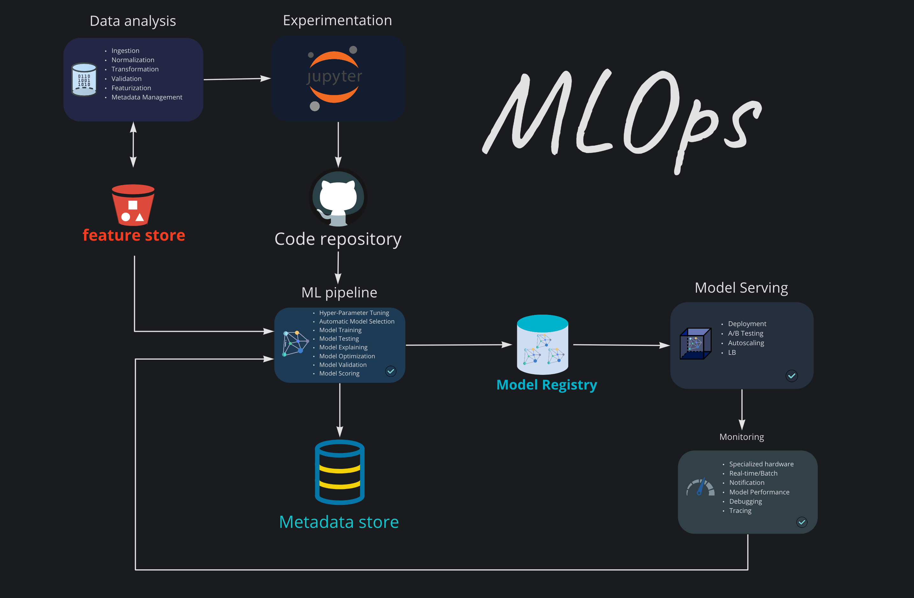

# exquisite-mlops-production


## Overview
Build an AI platform using open source as much as possible.    
favor and trust in open source.    




## metadata
* [DataHub](https://github.com/linkedin/datahub) 
```
DataHub is an open-source metadata platform for the modern data stack
```
## feature store
* [feast](https://github.com/feast-dev/feast)  
```
Feast is an open source feature store for machine learning.
Feast is the fastest path to productionizing analytic data for model training and online inference.
```
## Data orchestration
* [alluxio](https://github.com/Alluxio/alluxio) 
```
Alluxio (formerly known as Tachyon) is a virtual distributed storage system.
It bridges the gap between computation frameworks and storage systems,
enabling computation applications to connect to numerous storage systems through a common interface
```
* [fluid](https://github.com/fluid-cloudnative/fluid) 
```
Fluid is an open source Kubernetes-native Distributed Dataset Orchestrator and Accelerator for data-intensive applications,
such as big data and AI applications
```

## ML pipeline

### workflow
* [argo-workflows](https://github.com/argoproj/argo-workflows)  
```
Argo Workflows is an open source container-native workflow engine for orchestrating parallel jobs on Kubernetes. Argo Workflows is implemented as a Kubernetes CRD (Custom Resource Definition).
   Define workflows where each step in the workflow is a container.    
   Model multi-step workflows as a sequence of tasks or capture the dependencies between tasks using a directed acyclic graph (DAG).    
   Easily run compute intensive jobs for machine learning or data processing in a fraction of the time using Argo Workflows on Kubernetes.    
```

* [prefect](https://github.com/PrefectHQ/prefect) 
```
Prefect is a new workflow management system, designed for modern infrastructure and powered by the open-source Prefect Core workflow engine. Users organize Tasks into Flows, and Prefect takes care of the rest.
```
* [mlflow](https://github.com/mlflow/mlflow) 
```
MLflow is a platform to streamline machine learning development,   
including tracking experiments, packaging code into reproducible runs,  
and sharing and deploying models.     
MLflow offers a set of lightweight APIs that can be used with any existing machine learning application or library (TensorFlow, PyTorch, XGBoost, etc),       
wherever you currently run ML code (e.g. in notebooks, standalone applications or the cloud).     
MLflow's current components are:

MLflow Tracking:     
	An API to log parameters, code, and results in machine learning experiments and compare them using an interactive UI.
MLflow Projects:       
	A code packaging format for reproducible runs using Conda and Docker, so you can share your ML code with others.
MLflow Models:     
	A model packaging format and tools that let you easily deploy the same model (from any ML library) to batch and real-time scoring on platforms such as Docker, Apache Spark, Azure ML and AWS SageMaker.
MLflow Model Registry:      
	A centralized model store, set of APIs, and UI, to collaboratively manage the full lifecycle of MLflow Models.
```
* [airflow](https://github.com/apache/airflow) 
```
Apache Airflow (or simply Airflow) is a platform to programmatically author, schedule, and monitor workflows.

When workflows are defined as code, they become more maintainable, versionable, testable, and collaborative.

Use Airflow to author workflows as directed acyclic graphs (DAGs) of tasks.     
The Airflow scheduler executes your tasks on an array of workers while following the specified dependencies.      
Rich command line utilities make performing complex surgeries on DAGs a snap.     
The rich user interface makes it easy to visualize pipelines running in production, monitor progress, and troubleshoot issues when needed.
```

* [luigi](https://github.com/spotify/luigi) 
```
Luigi is a Python (3.6, 3.7, 3.8, 3.9 tested) package that helps you build complex pipelines of batch jobs.      
It handles dependency resolution, workflow management, visualization, handling failures, command line integration, and much more.
```
* [mlrun](https://github.com/mlrun/mlrun) 
```
MLRun is an open-source MLOps framework that offers an integrative approach to managing your machine-learning pipelines from early development through model development to full pipeline deployment in production. MLRun offers a convenient abstraction layer to a wide variety of technology stacks while empowering data engineers and data scientists to define the feature and models.
```

### Blog 
+ [Airflow vs. Luigi vs. Argo vs. MLFlow vs. KubeFlow](https://www.datarevenue.com/en-blog/airflow-vs-luigi-vs-argo-vs-mlflow-vs-kubeflow)
